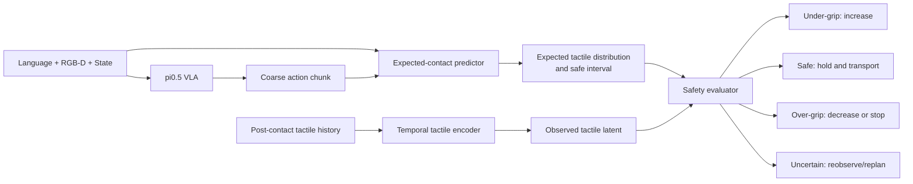

# 易碎/柔软物体安全抓取视触 VLA 研究方案

> 版本日期：2026-07-13  
> 机器人平台：Kinova Gen3 单臂、两指夹爪、RGB-D/视觉、夹爪触觉  
> 硬件限制：无腕部六维力/力矩传感器  
> 项目周期：约两个月

## 1. 我们目前针对什么问题

### 1.1 应用问题

本项目面向语言条件下易碎、柔软和可变形物体的安全抓取。

普通视觉 VLA 能够根据语言识别目标、规划接近轨迹并输出抓取动作，但仅依靠视觉难以观测夹爪与物体之间的局部压力、微小形变和初始滑移。因此容易出现两个相反的失败模式：

- 夹持不足：物体滑移、掉落或搬运失败；
- 夹持过度：物体破损、永久变形或违反“轻拿”等语言要求。

所以，本项目不只追求“能否抓起”，而是追求：

> **机器人能否根据语言和接触前视觉形成对未来接触的物理预期，并在接触后利用真实触觉判断当前夹持是不足、安全还是过度，从而稳定抓取且不损伤物体。**

### 1.2 任务中的三种模态

| 模态 | 主要作用 | 典型信息 |
|---|---|---|
| 语言 | 定义目标、抓取部位和物理要求 | “轻轻拿起”“不要压坏”“牢固抓住” |
| 视觉 | 接触前目标定位、姿态估计和粗动作规划 | 物体位置、尺寸、可见形变、候选抓取位姿 |
| 触觉 | 接触后物理验证和快速闭环控制 | 压力分布、左右不平衡、滑移趋势、形变和接触突变 |

语言不能只是固定任务标签。对于同一个物体，应使用会改变物理策略的指令，例如：

- “轻轻拿起纸杯，不要使它变形”；
- “牢固抓住纸杯并快速移动”；
- “抓住杯身”；
- “抓住把手”。

### 1.3 核心研究问题

建议将论文问题写成：

> **在语言条件安全抓取中，如何利用接触前视觉和候选动作预测期望触觉及安全接触区间，并在接触后通过校准式评估选择继续闭合、保持、减小夹持或重新规划？**

这比“给 VLA 加入触觉”更具体，也比“未来触觉预测 + residual action”多了一层安全评估和决策。

## 2. 建议的方法框架

### 2.1 总体结构



### 2.2 接触前预测

根据视觉、语言、机器人状态和 VLA 粗动作预测未来短时触觉分布：

```text
(mu_pred, sigma_pred, safe_interval)
    = F(vision, language, state, coarse_action)
```

预测目标不需要是完整未来视频，可以是未来 `4-16` 帧的低维 tactile latent、压力分布或左右接触状态。

### 2.3 接触后评估

```text
z_real = E_tactile(tactile_history)

normalized_discrepancy
    = distance(z_real, mu_pred) / sigma_pred
```

评估器输出：

```text
p_under_grip
p_safe_contact
p_over_grip
p_tactile_unreliable
correction_gate
```

动作决策：

- 夹持不足：增加夹爪闭合量或调整接触位姿；
- 安全稳定：保持当前夹持并搬运；
- 夹持过度：减小闭合量、停止闭合或回撤；
- 触觉不可信/异常严重：重新观察或调用 VLA 重规划。

### 2.4 是否属于世界模型

该方法使用了世界模型的预测思想，但不建议宣称为完整世界模型。

| 层级 | 能力 | 本项目是否需要 |
|---|---|---:|
| 触觉辅助预测 | 预测一个或短时 tactile latent | 是 |
| 局部接触预测模型 | 根据动作预测短时未来接触分布 | 是，推荐定位 |
| 完整视触世界模型 | 联合生成未来视觉、触觉和状态，多步 rollout并选择动作 | 否 |

推荐称为：

> **Action-conditioned Local Contact Prediction and Safety Evaluation**

这样可以借鉴 DreamTacVLA、OmniVTA 和 VTAM 的预测思想，又不承担完整世界模型的数据和训练成本。

## 3. 基座模型应该是什么

### 3.1 主基座：pi0.5 / OpenPI

推荐使用 [OpenPI](https://github.com/Physical-Intelligence/openpi) 中的 `pi0.5` 作为论文主基座。

主要理由：

1. TacVLA 已在 `pi05_base` 上验证低维触觉 token和接触门控，便于构造最公平的直接 baseline；
2. pi0.5 使用 action chunk和 flow matching，适合插入局部触觉预测器及 residual action；
3. 其 vision-language-action 能力比从零训练触觉策略更适合语言条件抓取；
4. 可以在相同主干、数据和动作空间下比较 vision-only、naive tactile、contact gate和完整方法；
5. 两指夹爪的末端位姿与夹爪动作比 T-Rex 的十指动作空间更容易适配 Kinova。

建议动作表示：

```text
[delta_x, delta_y, delta_z,
 delta_rx, delta_ry, delta_rz,
 gripper_delta]
```

如果旋转 residual 在 Kinova 上不稳定，可先固定腕姿，只预测三维平移和夹爪修正。

### 3.2 为什么不直接用完整 T-Rex 作为主基座

[T-Rex](https://github.com/ZhuoyangLiu2005/T-Rex) 是目前开放程度最高的触觉 VLA 工程之一，但原系统为：

- 双臂；
- 两只 22-DoF 灵巧手；
- 10 个指尖触觉传感器；
- 58/62D 状态和动作表示；
- 每指 6D wrench、时间窗口和 deformation map。

迁移到 Kinova 两指夹爪需要修改动作头、状态 schema、触觉 token数量、触觉 VQ-VAE、相机配置和机器人客户端。两个月内风险较高。

因此 T-Rex 更适合作为以下模块的代码参考：

- 慢视觉动作专家与快触觉专家；
- cached vision-language context；
- action flow分段；
- 时序触觉编码；
- ZMQ 快慢推理协议；
- LeRobot 数据组织。

### 3.3 工程保底：SmolVLA

如果 OpenPI/pi0.5 在现有算力或 Kinova 部署上无法及时跑通，可使用 [SmolVLA](https://huggingface.co/blog/smolvla) 作为工程保底。

SmolVLA 更轻、LeRobot 链路清晰，适合快速完成触觉 encoder、预测器和评估器消融。但论文主结果最好仍包含 pi0.5，保证与 TacVLA 等工作的可比性。

### 3.4 基座结论

```text
论文主基座：pi0.5 / OpenPI
触觉快慢结构参考：T-Rex
工程保底：SmolVLA
强视觉补充基线：OpenVLA-OFT（有余力时）
```

## 4. 主要参考论文

### 4.1 P0：与安全抓取最直接

#### VTAM

- 论文：[VTAM: Video-Tactile-Action Models for Complex Physical Interaction Beyond VLAs](https://arxiv.org/abs/2603.23481)
- 状态：arXiv 预印本；
- 解决问题：视觉模型难以预测接触力和微小形变，在薯片抓取等任务中容易过力；
- 创新：联合视觉/触觉未来预测、视频模型、action diffusion、virtual-force/deformation regularization；
- 借鉴：易碎物任务、触觉形变预测、防止视觉压制触觉；
- 局限：重型 world action model，语言和安全决策不是重点，不适合两个月完整迁移。

#### T-Rex

- 论文：[T-Rex: Tactile-Reactive Dexterous Manipulation](https://arxiv.org/abs/2606.17055)
- 代码：[官方仓库](https://github.com/ZhuoyangLiu2005/T-Rex)
- 状态：arXiv 预印本；
- 解决问题：VLA 频率不足，无法响应柔性物体形变和快速接触变化；
- 创新：Qwen3-VL-2B、variable-rate MoT、时序触觉 VQ-VAE、慢动作/快触觉专家、级联 flow matching；
- 借鉴：快触觉 residual和时序 encoder；
- 局限：十指双臂硬件差异大，没有显式安全区间或预测可靠性评估。

#### DreamTacVLA

- 论文：[Learning to Feel the Future: DreamTacVLA for Contact-Rich Manipulation](https://arxiv.org/abs/2512.23864)
- 状态：arXiv 预印本；
- 解决问题：机器人接触前不知道候选动作会产生什么触觉；
- 创新：高分辨率 tactile micro-vision、层级空间对齐、未来触觉预测、仿真与真实混合数据；
- 借鉴：视觉/动作条件的未来触觉预测；
- 局限：数据和训练成本高，预测不确定性与接触后安全决策不足。

#### OmniVTA

- 论文：[OmniVTA: Visuo-Tactile World Modeling for Contact-Rich Robotic Manipulation](https://arxiv.org/abs/2603.19201)
- 状态：arXiv 预印本；
- 解决问题：当前触觉作为被动输入，不能显式描述接触动力学或快速修正；
- 创新：短时视触世界模型、预测/真实触觉偏差、约 60 Hz反射控制；
- 借鉴：本项目最重要的 prediction-residual baseline；
- 局限：不是语言 VLA，偏差主要直接进入控制器，没有完整判断夹持不足、安全、过度和传感器故障。

### 4.2 P1：关键机制参考

#### AT-VLA

- 论文：[AT-VLA: Adaptive Tactile Injection for Enhanced Feedback Reaction in Vision-Language-Action Models](https://openaccess.thecvf.com/content/CVPR2026/html/Li_AT-VLA_Adaptive_Tactile_Injection_for_Enhanced_Feedback_Reaction_in_Vision-Language-Action_CVPR_2026_paper.html)
- 状态：CVPR 2026；
- 解决问题：触觉微调干扰预训练表示，以及 VLA 触觉反应过慢；
- 创新：Adaptive Tactile Injection、慢视觉语言流、快触觉流、约 0.04 秒闭环；
- 借鉴：adaptive injection和快慢控制 baseline；
- 局限：解决何时注入触觉，不显式建模物体损伤阈值和预期接触。

#### ForceVLA2

- 论文：[ForceVLA2: Unleashing Hybrid Force-Position Control with Force Awareness for Contact-Rich Manipulation](https://openaccess.thecvf.com/content/CVPR2026/html/Li_ForceVLA2_Unleashing_Hybrid_Force-Position_Control_with_Force_Awareness_for_Contact-Rich_CVPR_2026_paper.html)
- 状态：CVPR 2026；
- 解决问题：位置 VLA 无法主动调节接触力；
- 创新：force prompt、Cross-Scale MoE、目标力与位置联合输出、混合力位控制；
- 借鉴：语言到物理安全约束以及接触过载指标；
- 局限：依赖腕部 6D 力/力矩，本项目不能直接复现。

#### OmniVTLA

- 论文：[OmniVTLA: Vision-Tactile-Language-Action Models with Semantic-Aligned Tactile Sensing](https://arxiv.org/abs/2508.08706)
- 项目页：[ObjTac / OmniVTLA](https://readerek.github.io/Objtac.github.io/)
- 状态：最新版标注被 IEEE RA-L 接收，代码仍显示 Coming Soon；
- 解决问题：触觉与视觉/语言语义空间不一致；
- 创新：普通触觉 ViT + 语义对齐 SA-ViT 双路径、ObjTac 数据；
- 借鉴：软硬度、材质和语言物理要求的触觉表示；
- 局限：偏静态语义，对滑移、未来触觉和快速安全控制不足。

### 4.3 P2：基础门控与最新世界模型对标

#### TacVLA

- 论文：[TacVLA: Contact-Aware Tactile Fusion for Robust Vision-Language-Action Manipulation](https://arxiv.org/abs/2603.12665)
- 状态：arXiv 预印本，代码待发布；
- 解决问题：非接触触觉噪声干扰 VLA；
- 创新：`pi05_base` + 低维触觉 token + 二值接触 attention mask；
- 借鉴：最基础、最公平的 contact-gate baseline；
- 局限：只判断是否接触，不能判断夹持安全性和触觉可靠性。

#### VT-WAM 与 Tactile-WAM

- [VT-WAM](https://arxiv.org/abs/2607.02503)：联合预测未来视觉、触觉和动作，并使用接触引导的 attention；
- [Tactile-WAM](https://arxiv.org/abs/2606.26663)：使用非对称 attention避免 tactile pollution；
- 状态：均为较新的预印本；
- 借鉴：world-action-model 对标和模态干扰分析；
- 局限：模型较重，不适合当前周期完整复现。

## 5. 主要正面对比方法

所有核心方法应尽量使用相同 pi0.5 主干、训练数据、动作空间和 Kinova 硬件，避免直接比较不同论文中不可比的成功率。

| 编号 | 方法 | 对应论文思想 | 验证目的 |
|---|---|---|---|
| B0 | pi0.5 vision-only | pi0.5 | 视觉 VLA 基础能力 |
| B1 | pi0.5 + naive tactile | 普通融合 | 性能是否只是来自增加传感器 |
| B2 | pi0.5 + binary contact gate | TacVLA | 二值接触门控是否足够 |
| B3 | pi0.5 + adaptive tactile injection | AT-VLA-style | 自适应注入是否足够 |
| B4 | pi0.5 + fast tactile residual | T-Rex-style | 性能是否只是来自更高控制频率 |
| B5 | pi0.5 + future tactile prediction | DreamTacVLA-style | 预测触觉本身的贡献 |
| B6 | pi0.5 + prediction error + residual | OmniVTA-style | 直接用预测偏差控制是否足够 |
| Ours | prediction + safe interval + evaluator + routing | 本项目 | 安全评估和动作选择的额外价值 |

### 5.1 必须实际运行的 Baseline

```text
B0 pi0.5
B1 pi0.5 + naive tactile
B2 TacVLA-style contact gate
B3 AT-VLA-style adaptive injection
B4 T-Rex-style fast tactile expert
B6 OmniVTA-style prediction residual
Ours
```

如果实验量过大，可以把 B5 合并进 B6。OmniVTLA、VTAM、ForceVLA2、VT-WAM 和完整原版 T-Rex 由于代码或硬件差异，主要做论文级比较，不强行复现完整系统。

## 6. Benchmark B 设计

### 6.1 物体类别

- 易碎：薯片、饼干、薄壁塑料壳、纸杯；
- 柔软：海绵、泡沫块、软包装、可变形容器；
- 外观相似但刚度不同：用于检验视觉无法直接判断物理属性的情况；
- 表面摩擦不同：用于检验夹持不足与滑移恢复。

实际物体应优先选择损伤模式可重复、成本可控且安全阈值可标定的对象。

### 6.2 语言条件

同一物体至少设置两种物理要求：

```text
gentle: 轻轻拿起，不要产生明显变形
firm:   牢固抓住并完成快速搬运
```

模型应产生不同的目标触觉区间和夹持策略，否则语言模态没有真正参与安全控制。

### 6.3 核心指标

主指标定义为 Safe Grasp Success Rate：

```text
成功抓取并搬运
AND 未损伤物体
AND 未超过安全压力/形变阈值
AND 未发生掉落
AND 满足语言要求
```

辅助指标：

- 普通任务成功率；
- 物体损坏率和永久形变率；
- 峰值触觉压力；
- 压力时间积分；
- 超过安全阈值的持续时间；
- 最大形变量；
- 左右夹爪压力不平衡；
- 滑移次数、滑移距离和掉落率；
- 初始接触到稳定夹持的时间；
- 过力或滑移到修正动作的延迟；
- 重新抓取和重规划次数；
- 语言指令遵循率；
- evaluator 的 F1、AUROC、Brier Score和 ECE。

### 6.4 安全阈值标定

本项目没有腕部力传感器，因此安全评价应使用：

- 夹爪触觉压力/形变；
- 外部视觉测得的物体形变量；
- 离线标定得到的损伤阈值；
- 必要时使用电子秤或外部测力装置进行离线标定，但不作为在线模型输入。

只报告成功率不够。一个方法即使成功搬运，但显著压坏物体，也不能算安全抓取成功。

## 7. 预期创新点

以下内容已经被现有工作覆盖，不能单独作为创新：

- 在 VLA 中加入触觉；
- 接触后打开触觉 token；
- 自适应注入触觉；
- 慢 VLA + 快触觉控制；
- 预测未来触觉；
- 使用预测/真实触觉偏差直接修正动作。

建议将单一创新点定义为：

> **Language-conditioned Predictive Contact Safety Evaluation：通过语言定义任务相关的安全接触区间，接触前预测动作对应的触觉分布，接触后评估夹持不足、安全稳定、夹持过度及触觉不可信，并在继续、增力、减力和重规划之间进行动作路由。**

与关键工作的区别：

| 工作 | 已解决 | 本项目增加 |
|---|---|---|
| TacVLA | 是否发生接触 | 接触是否安全以及应如何调整 |
| AT-VLA | 何时、在哪里注入触觉 | 触觉对应的安全状态和动作决策 |
| T-Rex | 如何快速响应触觉 | 响应前先进行安全评估 |
| DreamTacVLA | 如何预测未来触觉 | 如何用语言定义安全区间并验证实际接触 |
| OmniVTA | 如何利用预测偏差反射 | 将偏差解释成不足/安全/过度/不可信并执行不同策略 |
| VTAM | 如何联合学习视触动力学 | 轻量、可执行的安全抓取决策接口 |

## 8. 最终结论

### 我们解决的问题

```text
语言条件下易碎/柔软物体的安全抓取：
在稳定夹持与避免损伤之间，根据接触前视觉预期和接触后真实触觉进行闭环决策。
```

### 我们的基座

```text
主基座：pi0.5 / OpenPI
快触觉结构参考：T-Rex
工程保底：SmolVLA
```

### 主要参考论文

```text
任务与安全形变：VTAM
高频触觉控制：T-Rex、AT-VLA
未来触觉预测：DreamTacVLA
预测偏差与反射：OmniVTA
触觉语义与软硬属性：OmniVTLA
安全力控思想：ForceVLA2
基础接触门控：TacVLA
最新世界模型对标：VT-WAM、Tactile-WAM
```

### 论文核心主张

> 我们不是简单地让 VLA 感知触觉，而是让机器人根据语言和视觉形成接触安全预期，并在真实接触发生后判断当前夹持是否不足、安全或过度，从而以可解释的方式完成安全闭环抓取。
